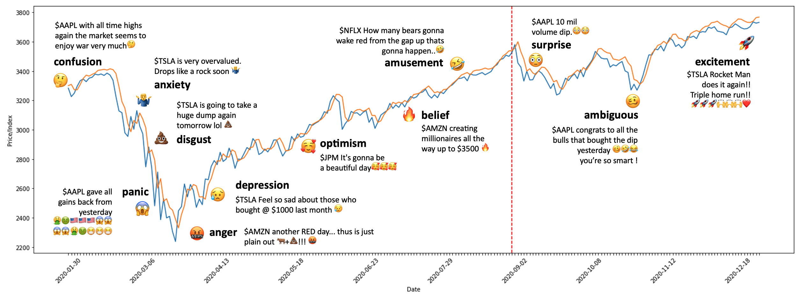
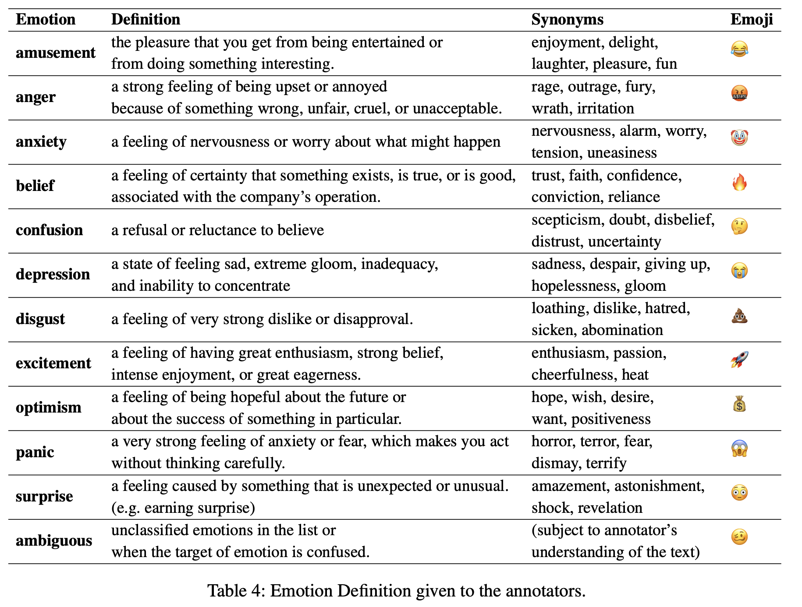
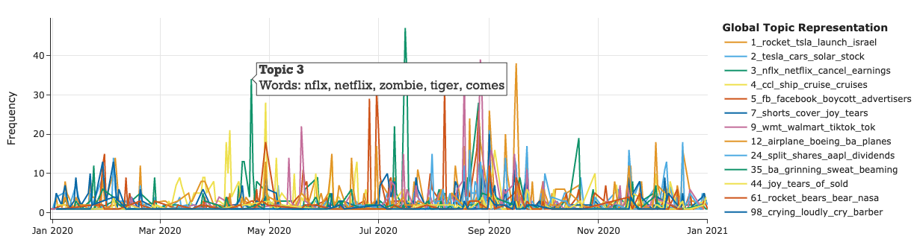
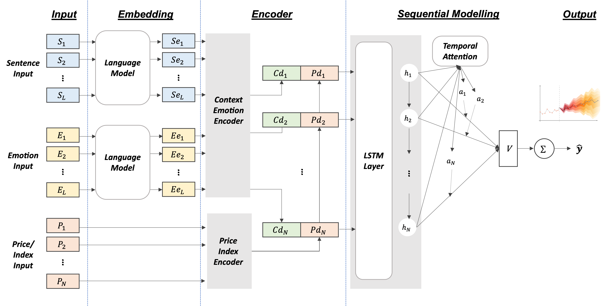

<h1 align="center">StockEmotions: Discover Investor Emotions for Financial Sentiment Analysis and Multivariate Time Series</h1>

<p align="center">
		     
</p>

This repository contains a financial-domain-focused dataset for financial sentiment/emotion classification and stock market time series prediction. It's based on our paper: [StockEmotions: Discover Investor Emotions for Financial Sentiment Analysis and Multivariate Time Series](https://arxiv.org/abs/2301.09279) accepted by AAAI 2023 Bridge (AI for Financial Services).


## Key statistics of the data
- Data collection period : **Jan 2020 - Dec 2020**
- Number of Utterance : **10,000**  (train 80%, val 10%, test 10%)
- Sentiment classes: 2 annotated by users 
    - **bullish** (~positive), **bearish** (~negative)
- Emotion classes: 12 annotated by Human & AI collaboration
    - **ambiguous, amusement, anger, anxiety, belief, confusion, depression, disgust, excitement, optimism, panic, surprise** 
<p align="left"></p>


## Data explained
- tweet folder
    - **processed.csv**: 50,281 samples with text processed data (handling emoji and CTAG). It is used for Topic Modelling before proceeding with the emotion annotation.
    - **train, val, test.csv** : In total, 10,000 samples. Each file has id, date, ticker, emo_label, senti_lable, original, and processed content. For the data curation, processing (e.g. emoji, CTAG, HTAG), and annotation, we refer to our paper. The dataset is used for Financial Sentiment/Emotion Classification tasks. 
- price folder
    - **38 companies histrical price data** in csv format. The tweet and price dataset together are used for Multivariate Time Series tasks. 
    - Tickers: 
        'AAPL', 'ABNB', 'AMT', 'AMZN', 'BA', 'BABA', 'BAC', 'BKNG', 'BRK.A', 'BRK.B', 'CCL', 'CVX',
        'DIS', 'FB', 'GOOG', 'GOOGL', 'HD', 'JNJ', 'JPM', 'KO', 'LOW', 'MA', 'MCD', 'MSFT', 'NFLX',
        'NKE', 'NVDA', 'PFE', 'PG', 'PYPL', 'SBUX', 'TM', 'TSLA', 'TSM', 'UNH', 'UPS', 'V', 'WMT', 'XOM'
        - 'FB' ticker is changed to 'META', but the time at the data collection was 'FB'.

[](https://colab.research.google.com/drive/1nL_85zsePTPXq4wbU9LD6XFEKeJVNe4X?usp=sharing)


## Topic Modeling and Data Creation
<p align="left"></p>

We conduct topic representations using BERTopic to understand whether the curated data represents emotions and to establish the sampling strategy for annotation.  


## Multivariate Time Series
<p align="left"></p>

We implement a Temporal Attention LSTM with bidirectional encoder representations from transformers (BERT). We will share more experiment results and ablation testing results for further research. 


## Citation

```bibtex
    @article{lee2023stockemotions,
    title={StockEmotions: Discover Investor Emotions for Financial Sentiment Analysis and Multivariate Time Series},
    author={Lee, Jean and Youn, Hoyoul Luis and Poon, Josiah and Han, Soyeon Caren},
    journal={arXiv preprint arXiv:2301.09279},
    year={2023}
    }
```

**Disclaimer:** 
The data collected for this research follows to the terms and conditions of StockTwits and Yahoo Finance. All data included in this research has been anonymized to ensure privacy and confidentiality. If the respective website claims any concerns regarding the data used in this research, we are committed to removing such data from our records. In addition, by using or accessing the information in this repository, you agree to indemnify, defend, and hold harmless the authors, contributors, and any affiliated organizations or persons from any and all claims or damages.


